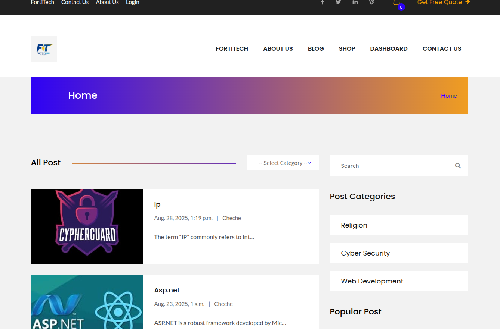
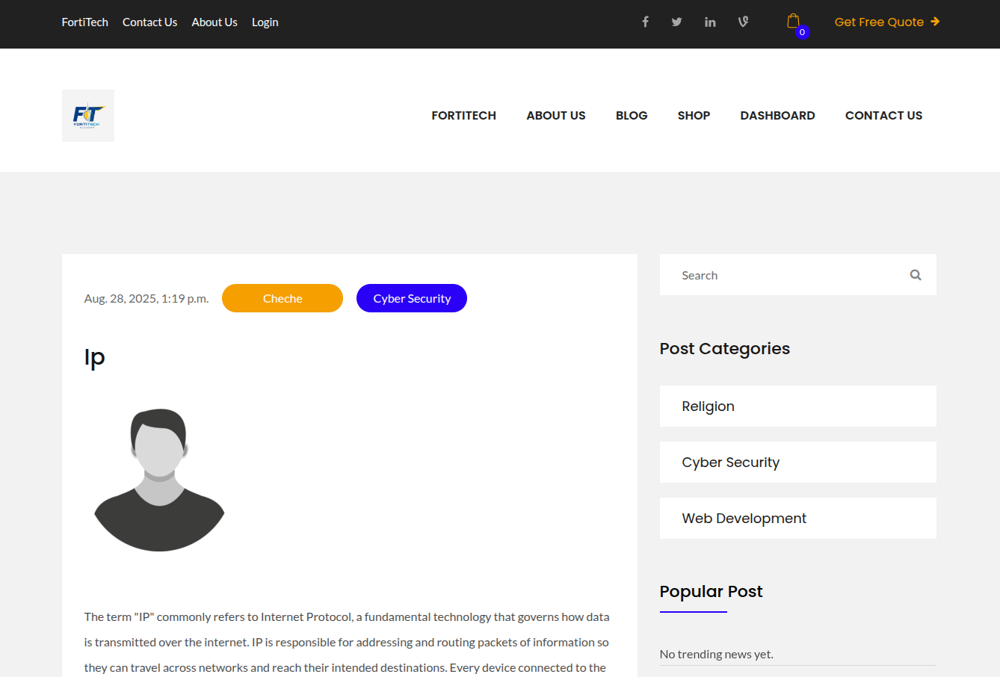
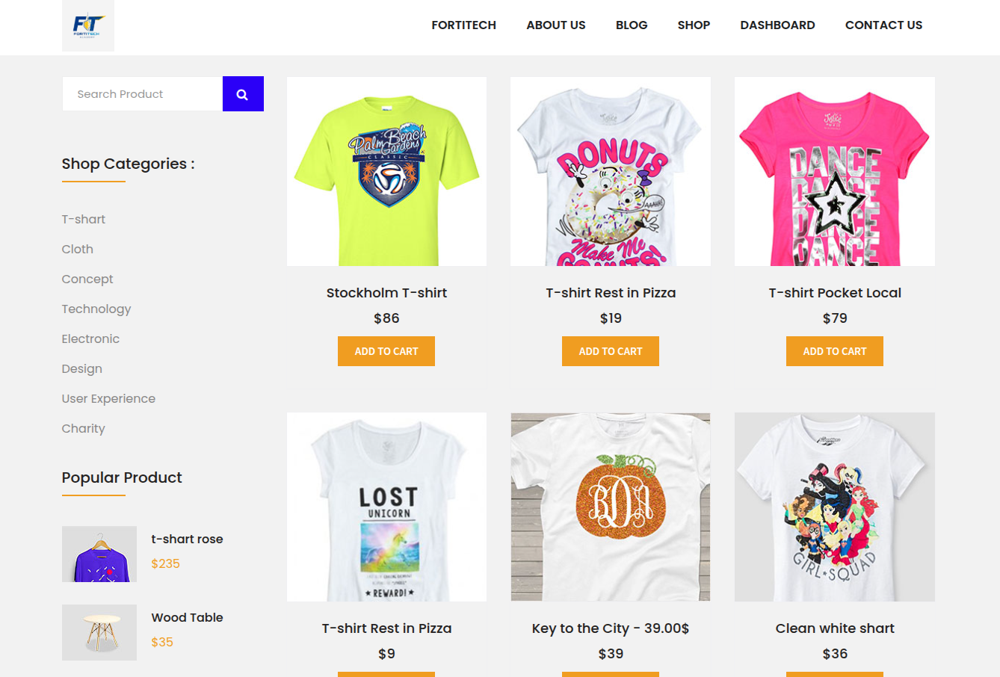

```markdown
# Django Blog & Shop Web App


A combined blog and ecommerce platform built with Django, featuring:

- User-friendly product catalog with search and categories
- Detailed product pages with high-quality images and descriptions
- Shopping cart: add, update, or remove items
- Secure Stripe-powered checkout
- User registration, login, and profile management
- Order history and tracking for users
- Responsive design using Bootstrap
- Admin dashboard for managing products, orders, users, and content
- Product image uploads and real-time form validation

## Blog Features

- Only admins can create, edit, and publish blog posts via Django admin
- Blog management integrated with ecommerce
- Visitors can read articles that complement products

This platform combines content and commerce for a secure, manageable experience for users and administrators.

---

## Getting Started

### Prerequisites

| Name       | Version/Requirement              |
|------------|----------------------------------|
| Python     | 3.8 or higher                    |
| pip        | Latest                           |
| PostgreSQL | Recommended (update settings)    |
| Stripe     | Account (for API keys)           |

### Installation

1. **Clone the repository:**
    ```sh
    git clone <repository-url>
    cd <project-folder>
    ```
2. **Create and activate a virtual environment:**
    ```sh
    python3 -m venv .venv
    source .venv/bin/activate   # Windows: .venv\Scripts\activate
    ```
3. **Install dependencies:**
    ```sh
    pip install -r requirements.txt
    ```
4. **Configure environment variables:**  
    Create a `.env` file in the project root:
    ```
    DJANGO_SECRET_KEY=your_secret_key
    DB_NAME=your_db_name
    DB_USER=your_db_user
    DB_PASSWORD=your_db_password
    STRIPE_PUBLIC_KEY=your_stripe_public_key
    STRIPE_SECRET_KEY=your_stripe_secret_key
    ALLOWED_HOSTS=localhost,127.0.0.1,your-domain
    ```
5. **Apply database migrations:**
    ```sh
    python manage.py migrate
    ```
6. **Create a superuser:**
    ```sh
    python manage.py createsuperuser
    ```
7. **Collect static files:**
    ```sh
    python manage.py collectstatic --noinput
    ```

### Running the Development Server

Start the server locally:
```sh
python manage.py runserver
```
Access the app at [http://127.0.0.1:8000/](http://127.0.0.1:8000/)

---

## Product Images

| ID | Image                                      |
|----|--------------------------------------------|
| 1  |  |
| 2  |  |
| 3  |  |

---

## License

Licensed under the MIT License. See [MIT License](LICENSE) for details.

---

Questions or contributions? Open an issue or submit a pull request.
```

